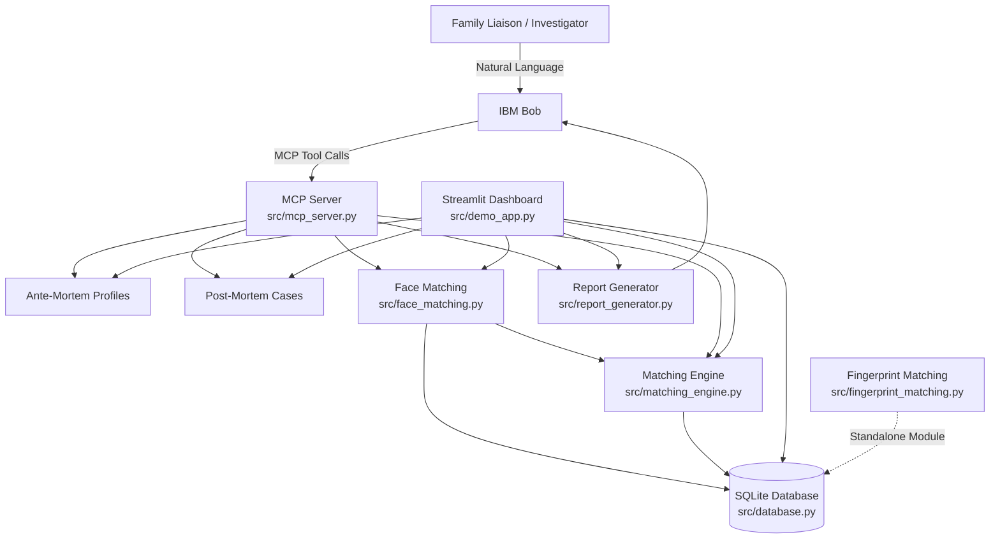

# Architecture

## System Architecture

[Describe the overall architecture of your system. Replace the Mermaid diagram below with your actual architecture.]

```
## System Architecture



## Components

| Component | Technology | Responsibility |
|---|---|---|
| Conversational Front End | IBM Bob | Provides the natural-language interface for investigators and family liaisons. |
| MCP Server | Python, MCP | Exposes the system capabilities as tools that IBM Bob can call. |
| Matching Engine | Python (`src/matching_engine.py`) | Performs deterministic candidate matching using demographics, distinguishing marks, dental findings, clothing/personal effects, and optional facial similarity. |
| Face Matching | InsightFace / ArcFace, ONNX Runtime, OpenCV (`src/face_matching.py`) | Processes photographs locally, detects faces, generates face embeddings, evaluates image quality, and calculates facial similarity. |
| Fingerprint Matching | Python (`src/fingerprint_matching.py`) | Provides fingerprint image processing, minutiae extraction, and fingerprint comparison as a standalone module. |
| Database | SQLite (`src/database.py`) | Stores ante-mortem profiles, post-mortem observations, photo metadata and embeddings, and match audit records. |
| Report Generator | Python (`src/report_generator.py`) | Generates explainable reconciliation reports containing candidate scores, evidence, rationale, and confidence information. |
| Demo Dashboard | Streamlit (`src/demo_app.py`) | Provides a visual interface for creating records, uploading photographs, running matching, and viewing reconciliation results. |


## Data Flow

1. The family liaison or investigator interacts with IBM Bob using natural language.

2. IBM Bob interprets the request and invokes the appropriate MCP tool exposed by
   `src/mcp_server.py`.

3. Ante-mortem profiles and post-mortem observations are created and stored in
   the SQLite database through `src/database.py`.

4. Photographs can be uploaded for an ante-mortem profile or post-mortem case.
   `src/face_matching.py` processes the photographs locally, detects faces,
   generates ArcFace embeddings, evaluates image quality, and stores the
   resulting metadata and embeddings in SQLite.

5. When candidate matching is requested, the MCP server invokes
   `src/matching_engine.py`.

6. The matching engine compares the post-mortem observation against available
   ante-mortem profiles using deterministic matching rules based on demographics,
   distinguishing marks, dental findings, clothing/personal effects, and
   available facial similarity information.

7. Candidates are assigned a deterministic match score and an explainable
   rationale. Hard biological exclusion rules can remove incompatible candidates.

8. Matching results and audit information are stored in the SQLite database.

9. The report generator (`src/report_generator.py`) creates a reconciliation
   report containing candidate scores, supporting evidence, rationale, and
   confidence information.

10. The generated results are returned through the MCP server to IBM Bob and
    can also be viewed through the Streamlit dashboard.

11. The fingerprint matching module (`src/fingerprint_matching.py`) provides
    fingerprint processing and comparison functionality as a standalone module.
    It is not currently integrated into the primary candidate-scoring pipeline.

## Security Considerations

- **Sensitive Data:** Ante-mortem and post-mortem records may contain sensitive
  personal, medical, photographic, and biometric-derived information.

- **Biometric Data Protection:** Face embeddings and fingerprint-related data
  are sensitive biometric information and should be protected using encryption,
  strict access controls, and appropriate retention and deletion policies in a
  production deployment.

- **Local Processing:** Face matching and biometric processing are performed
  locally by the application rather than sending biometric data to an external
  AI service.

- **Database Security:** The SQLite database contains sensitive case records,
  photo metadata, embeddings, and matching audit information. Production
  deployments should use encrypted storage and appropriate database access
  controls.

- **Authentication and Authorization:** The current prototype does not include
  a dedicated authentication or role-based access-control layer. A production
  deployment should require authenticated users and restrict access according
  to investigator, administrator, and other authorized roles.

- **MCP Tool Access:** MCP tools should only be exposed to authorized clients.
  Production deployments should apply authentication, authorization,
  input validation, and secure transport to MCP communication.

- **Input Validation:** User-provided profile information, observations,
  photographs, and tool parameters should be validated before processing to
  prevent malformed or unexpected input from affecting the system.

- **Auditability:** Matching operations and candidate results should remain
  auditable through database records and match audit information so that
  investigators can review how results were produced.

- **Explainability:** Matching results are generated using deterministic
  scoring and provide supporting evidence and rationale rather than relying
  solely on an opaque generative-AI decision.

- **Production Hardening:** Before deployment with real cases, the system
  should implement encrypted communication, secure secrets management,
  authentication, authorization, encrypted backups, logging and monitoring,
  data-retention controls, and regular security testing.

- **Prototype Limitation:** The current implementation is a demonstration
  prototype and should not be treated as a production forensic identification
  system without appropriate validation, security controls, legal review,
  and operational safeguards.

## Scalability

- **Database:** SQLite can be migrated to PostgreSQL for larger datasets and concurrent users.
- **Application:** MCP server, matching engine, and dashboard can be deployed as separate services and scaled independently.
- **Face Matching:** Face embeddings can be generated once and reused to reduce processing time.
- **Performance:** Database indexing, caching, and asynchronous matching can improve performance for large case volumes.
- **Production:** Containerization and cloud deployment can support horizontal scaling as users and cases increase.
