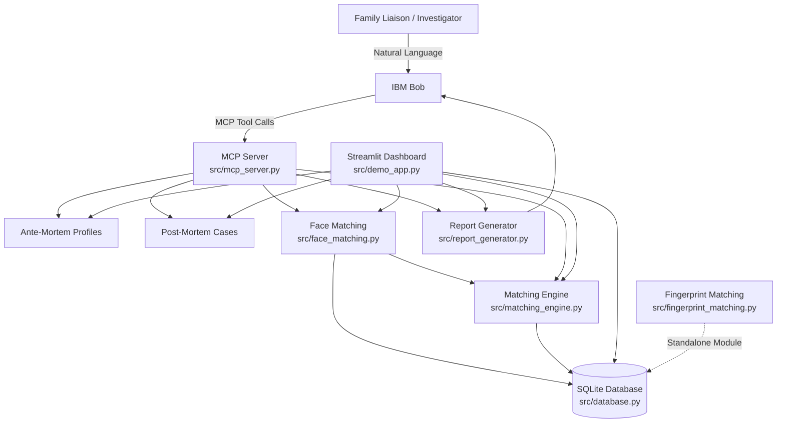

# Solution Overview

## What We Built

**Reconcile** is a Bob-powered DVI coordination tool that helps investigators
and family liaisons organize and reconcile ante-mortem (AM) and post-mortem
(PM) information. Users can enter records conversationally through IBM Bob or
through the Streamlit dashboard.

The system uses a deterministic matching engine to compare AM and PM records
using structured evidence such as demographics, distinguishing marks, dental
features, clothing/effects, and available facial similarity. Face photographs
can be processed locally using face embeddings, while fingerprint processing
is available as a separate biometric module.

For each PM case, Reconcile prioritizes potential AM candidates, provides
component-level scoring and plain-English rationale, and generates a
reconciliation report for review by a qualified forensic examiner. The system
is designed to assist investigators while keeping final identification under
human oversight.

## How It Works

1. **Collect AM and PM information** — Investigators enter missing-person
   profiles and post-mortem observations through IBM Bob or the Streamlit
   dashboard.

2. **Add supporting evidence** — Records can include physical characteristics,
   distinguishing marks, dental information, clothing/effects, photographs,
   and available biometric evidence.

3. **Process photographs** — Uploaded face photographs can be processed
   locally to generate face embeddings and calculate facial similarity.

4. **Match candidates** — The deterministic matching engine compares each
   post-mortem case against available ante-mortem profiles using structured
   evidence and available facial similarity.

5. **Explain the results** — Candidates receive component-level scores and
   plain-English rationale, with hard exclusion rules applied where applicable.

6. **Generate a report** — The system produces a reconciliation report
   containing the candidate results and supporting evidence for investigator
   review.

7. **Human review** — Qualified investigators review the evidence and
   determine the final identification. The system assists the process rather
   than making the final identification decision.

## Architecture Diagram

> See [`architecture.md`](architecture.md) for the detailed diagram.

## Key Design Decisions

- **Human-in-the-loop:** The system prioritizes potential matches and provides
  supporting evidence, while final identification remains with qualified
  forensic investigators.

- **Deterministic matching:** Candidate scoring is rule-based and
  explainable rather than relying on an opaque AI-generated decision.

- **Local biometric processing:** Face photographs are processed locally to
  generate embeddings and calculate facial similarity.

- **MCP integration:** IBM Bob communicates with the application through an
  MCP server, allowing the same backend capabilities to be used through a
  conversational interface.

- **Shared data layer:** The Streamlit dashboard and MCP server use the same
  SQLite database, keeping AM/PM records and matching results consistent.

- **Modular biometric support:** Fingerprint processing is implemented as a
  separate module so it can be integrated into the main matching workflow
  as the system evolves.

## IBM Technologies Used

- **IBM Bob:** Conversational interface for investigators and family
  liaisons to interact with the DVI system using natural language.

- **IBM Bob MCP Integration:** Connects IBM Bob to the application's backend
  capabilities through the Model Context Protocol (MCP) server.

- **IBM watsonx.ai:** Supported as an optional integration for AI-powered
  report narration when configured through the environment variables.

- **MCP Server:** Provides structured tools that IBM Bob can use for profile
  creation, case management, matching, biometric comparison, and report
  generation.

The core matching, database, face-processing, fingerprint-processing, and
dashboard components run locally in Python.